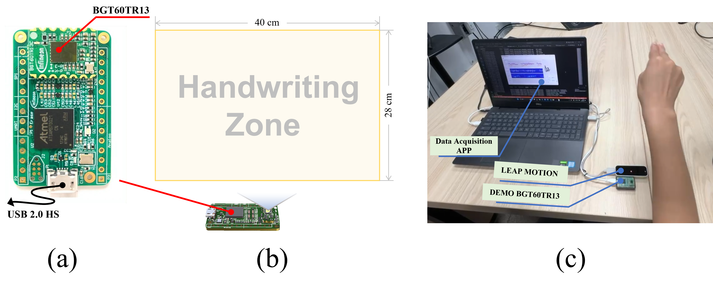

# 🎯 Data Capture System

<div align="center">
  
  <p><em>mmScribe Data Collection System Architecture</em></p>
</div>

## 📋 System Overview

The mmScribe Data Capture System is designed for efficient and accurate collection of aerial handwriting data using millimeter-wave radar technology. Our system synchronously captures both radar signals and ground truth data, ensuring high-quality dataset construction.

## 🛠️ Hardware Requirements

### Essential Equipment
- **Millimeter-wave Radar**
  - Model: Demo BGT60TR13 
  - Frame time: 38.4ms
  - Working Frequency: 58-63GHz

- **Leap Motion Controller**
  - Model: LM-010
  - Tracking Rate: 120fps
  - Field of View: 150° × 120°

- **Computer System**
  - CPU: Intel i5 or higher
  - RAM: 8GB minimum (16GB recommended)
  - USB 3.0 ports: At least 2
  - OS: Windows 10/11

### Optional Equipment
- 📺 External Display (for real-time visualization)
- 🔌 USB Hub (if more ports needed)
- 📱 Android Device (for mobile testing)

## 🚀 Setup Guide

### 1. Hardware Setup
1. Position the radar sensor:
   - Height: 30cm above the writing surface
   - Angle: 45° towards the writing area
   - Clear field of view: 50cm × 50cm

2. Mount Leap Motion:
   - Place directly above the writing area
   - Height: 25cm from surface
   - Ensure unobstructed view

<div align="center">
  
  <p><em>Hardware Setup Configuration</em></p>
</div>

### 2. Software Installation

```bash
# Clone the repository
git clone https://github.com/Tkwer/mmScribe.git

# Install dependencies
cd mmScribe/DataCaptureSystem
pip install -r requirements.txt

# Install radar SDK
./install_radar_sdk.sh

# Install Leap Motion SDK
./install_leap_sdk.sh
```

## 💻 User Interface

<div align="center">
  
  <p><em>Data Collection Interface</em></p>
</div>

### Main Features
- 📊 Real-time signal visualization
- 👆 Hand tracking display
- ⚡ Signal quality indicators
- 📝 Session management
- 🎥 Recording controls

## 🔄 Collection Process

1. **System Initialization**
   ```bash
   python DataCaptureSystem/main.py
   ```

2. **Participant Setup**
   - Register participant information
   - Calibrate writing area
   - Perform test recordings

3. **Data Collection**
   - Select vocabulary list
   - Start recording session
   - Monitor signal quality
   - Save and verify data

4. **Post-Processing**
   - Data validation
   - Format conversion
   - Quality assessment

## 📊 Data Verification

The system provides real-time data quality checks:
- ✅ Signal strength verification
- ✅ Hand tracking confidence
- ✅ Data synchronization status
- ✅ Storage space monitoring

## 🤝 Contributing Data

We encourage researchers and institutions to contribute their collected data to enrich the mmScribe dataset. Here's how you can help:

1. **Data Collection Guidelines**
   - Follow the setup instructions precisely
   - Use the provided calibration tools
   - Document any modifications to the setup

2. **Data Submission**
   - Format your data according to our specifications
   - Include participant demographics (anonymized)
   - Provide collection environment details

3. **Contact Us**
   - Email: [contact@mmscribe.org](mailto:contact@mmscribe.org)
   - Create an issue in our repository
   - Join our research community

### Benefits of Contributing
- 🌟 Recognition in project documentation
- 🔄 Access to expanded dataset
- 👥 Join collaborative research efforts
- 📚 Early access to research findings

> **Note**: All contributed data must comply with privacy regulations and ethical guidelines. Please ensure proper consent is obtained from participants.

## 📝 License

This data collection system is released under the MIT License. See [LICENSE](../LICENSE) for details.

## 🆘 Support

Need help setting up the system or have questions?
- 📖 Check our [Wiki](../../wiki)
- 💬 Join our [Discord Community](https://discord.gg/mmscribe)
- 📧 Contact: [support@mmscribe.org](mailto:support@mmscribe.org) 