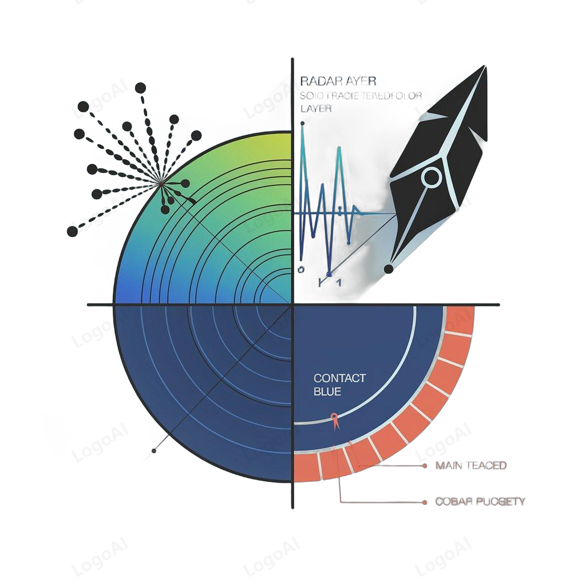

# mmScribe 🎯

<div align="center">
  
  
  **A Deep Learning-based Gesture Recognition System Using Millimeter-wave Radar**
  
  [](https://opensource.org/licenses/MIT)
  
  [](https://github.com/yourusername/RadarScribe/stargazers)
</div>

## 🌟 Overview

**mmScribe** is an innovative gesture recognition system that enables contactless human-computer interaction through millimeter-wave radar technology. The system accurately captures user gestures and converts them into text input, providing a novel approach to human-computer interaction.

## ✨ Key Features

- 🎯 High-precision gesture recognition
- 📱 Cross-platform compatibility (Android, Windows, Raspberry Pi)
- ⚡ Real-time response with low latency
- 🔒 Privacy-preserving interaction
- 🛠️ Easy integration with existing systems
- 📊 Comprehensive data analysis tools

## 🎬 Demos

<table>
  <tbody>
    <tr>
      <td align="center">
        <a href="res/Android.mp4">Android Demo</a>
      </td>
      <td align="center">
        <a href="res/laptop.mp4">Laptop Demo</a>
      </td>
      <td align="center">
        <a href="res/RPi4B.mp4">Raspberry Pi Demo</a>
      </td>
    </tr>
    <tr>
      <td>
        <video src="res/Android.mp4">
      </td>
      <td>
        <video src="res/laptop.mp4">
      </td>
      <td>
        <video src="res/RPi4B.mp4">
      </td>
    </tr>
  </tbody>
</table>

## 🚀 Quick Start

### Prerequisites

- Python 3.8 or higher
- CUDA-compatible GPU (optional, for faster processing)
- Compatible radar hardware

### Installation

```bash
# Clone the repository
git clone https://github.com/yourusername/RadarScribe.git

# Navigate to project directory
cd RadarScribe

# Install dependencies
pip install -r requirements.txt
```

### Basic Usage

1. Connect your radar hardware
2. Run the main program:
```bash
python run_gesture_recognition.py
```
3. Follow the on-screen instructions for gesture input

## 📚 Documentation

For detailed documentation, please visit our [Wiki](../../wiki).

## 🤝 Contributing

We welcome contributions! Please see our [Contributing Guidelines](CONTRIBUTING.md) for details.

### Development Setup

```bash
# Create a virtual environment
python -m venv venv
source venv/bin/activate  # Linux/Mac
# or
.\venv\Scripts\activate  # Windows

# Install development dependencies
pip install -r requirements-dev.txt
```

## 📝 License

This project is licensed under the MIT License - see the [LICENSE](LICENSE) file for details.

## 📮 Contact

- **Maintainer**: [Your Name]
- **Email**: [your.email@example.com]
- **Project Link**: [GitHub Repository](https://github.com/yourusername/RadarScribe)

## ⭐ Show Your Support

If you find this project useful, please consider giving it a star on GitHub!