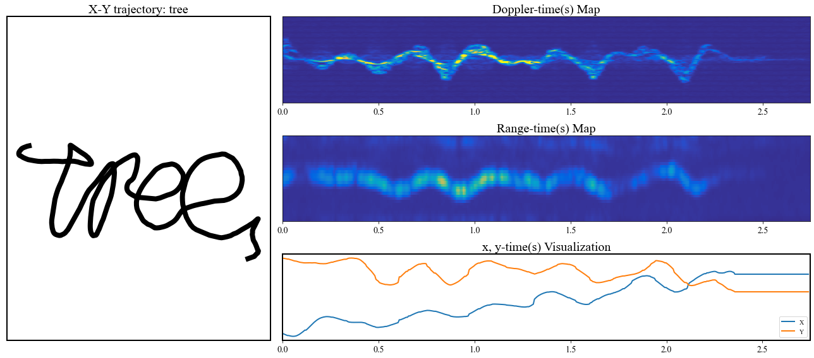

# 📊 mmScribe Dataset Documentation

<div align="center">
  
**A Comprehensive Dataset for Aerial Handwriting Recognition Using Millimeter-wave Radar**

</div>

## 📋 Dataset Overview

The mmScribe dataset is a large-scale collection of aerial handwriting samples captured using millimeter-wave radar technology. This dataset is designed to support research in contactless human-computer interaction and gesture recognition.

### 👥 Participant Demographics

- **Total Participants**: 12 (6 males, 6 females)
- **Age Range**: 20-27 years
- **Total Samples**: 15,488
- **Average Samples per User**: ~1,200

### 📝 Collection Methodology

Prior to data collection:
- Participants received a brief introduction to the system
- Writing area demonstration was provided
- No restrictions on:
  - Writing speed
  - Stroke order
  - Personal writing habits

This approach ensured natural writing styles were preserved.

## 📊 Dataset Statistics

<div align="center">

| Dataset Folder | Volunteer ID | Gender | Age | Handedness | Number of Samples | Reserved |
|:--------------:|:------------:|:------:|:---:|:----------:|:----------------:|:---------:|
| datas1         | -            | -      | -   | -          | -                | Access not supported |
| datas2         | 001          | Male 👨 | 26  | Right      | 1,212            | - |
| datas3         | 002          | Male 👨 | 26  | Right      | 1,202            | - |
| datas4         | 003          | Male 👨 | 25  | Right      | 1,197            | - |
| datas5         | 004          | Male 👨 | 26  | Right      | 613              | - |
| datas6         | 005          | Male 👨 | 22  | Right      | 1,621            | - |
| datas7         | 006          | Female 👩 | 23  | Right      | 1,271            | - |
| datas8         | 007          | Female 👩 | 22  | Right      | 1,299            | - |
| datas9         | 008          | Male 👨 | 22  | Right      | 750              | - |
| datas10        | 009          | Female 👩 | 23  | Right      | 1,261            | - |
| datas11        | 010          | Female 👩 | 22  | Right      | 1,278            | - |
| datas12        | 011          | Male 👨 | 22  | Right      | 1,324            | - |
| datas13        | 012          | Male 👨 | 22  | Right      | 1,256            | - |
| datas14        | 013          | Male 👨 | 21  | Right      | 1,192            | - |

</div>

## 🛠️ Data Collection System

<div align="center">
  
  <p><em>Synchronized Data Collection System Setup</em></p>
</div>

Our data collection system combines:
- ⚡ Millimeter-wave radar
- 🖐️ Leap Motion controller
- 💻 PC-based collection application

### Key Features
- 📊 USB interface connectivity
- 🎯 Precise hand joint tracking
- ✂️ Automatic data length truncation
- 📍 Ground truth from index fingertip trajectory

## 📁 Data Format

### File Structure
- Format: `.npy` files
- Naming: `data_yyyymmdd_hhmmss.npy`
- Example: `data_20240508_210234.npy`

### Data Dimensions
- Shape: \(T \times 163\)
- \(T\): Data frame length
- Features:
  - `data[:,:128]`: Micro-Doppler time features
  - `data[:, 128:160]`: Range-time features
  - `data[:, 160:162]`: X-Z coordinate position (Leap Motion)
  - `data[:, 163]`: Reserved

<div align="center">
  
  <p><em>Data Visualization Example</em></p>
</div>

> **Note**: Current research focuses on micro-Doppler time features. Range-time features and coordinate position information are provided for future research opportunities.

## 📥 Download

The complete dataset is available for download at this [Link](https://drive.google.com/drive/folders/1QLft6EX2YqXKLQdCAynuIpeRZuttKSZM?usp=sharing).

## 📚 Citation

If you use this dataset in your research, please cite our paper:
```bibtex
@article{mmscribe2024,
  title={mmScribe: Streaming End-to-End Aerial Handwriting Text Translation via mmWave Radar},
  author={Your Name et al.},
  journal={Your Journal},
  year={2024}
}
```

