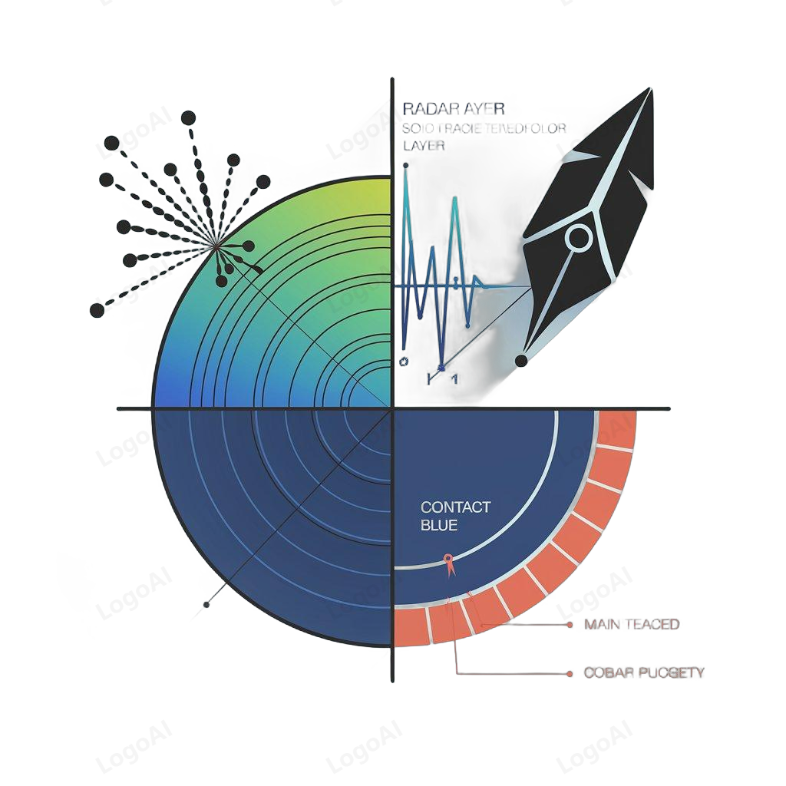

# 📱 mmScribe Runtime

<div align="center">
  
  
  **Cross-platform Runtime for mmScribe Gesture Recognition System**
</div>

## 📋 Overview

mmScribe runtime provides cross-platform support for the gesture recognition system, currently available for:
- 📱 Android
- 🖥️ Windows
- 🍓 Raspberry Pi

## 🛠️ Hardware Requirements

### Essential Equipment
- **Radar Sensor**
  - Model: ESP32-BGT60TR13
  - Working Frequency: 58-63GHz
  - Interface: USB/UART
  - Power Supply: 5V via USB

### Platform-specific Requirements

<table>
  <tr>
    <th>Platform</th>
    <th>Requirements</th>
    <th>Status</th>
  </tr>
  <tr>
    <td>📱 Android</td>
    <td>
      - Android 8.0+<br>
      - USB OTG support<br>
      - 2GB+ RAM
    </td>
    <td>✅ Released Binary file</td>
  </tr>
  <tr>
    <td>🖥️ Windows</td>
    <td>
      - Windows 10/11<br>
      - USB 2.0+ port<br>
      - 4GB+ RAM
    </td>
    <td>🚧 Provided source code and libs</td>
  </tr>
  <tr>
    <td>🍓 Raspberry Pi</td>
    <td>
      - Raspberry Pi 4B+<br>
      - 2GB+ RAM<br>
      - Raspbian OS
    </td>
    <td>🚧 Provided source code and libs</td>
  </tr>
</table>

## 📲 Android Installation

1. **Hardware Setup**
   - Connect ESP32-BGT60TR13 to your Android device via USB-C/OTG cable
   - Ensure proper power supply to the radar module

2. **Software Installation**
   ```bash
   # Download the latest APK
   wget https://github.com/Tkwer/mmScribe/releases/latest/download/mmScribe.apk
   
   # Or scan the QR code below
   ```
   <div align="center">
     
   </div>

3. **First Launch**
   - Grant USB access permission
   - Follow the calibration wizard
   - Start writing!

## 🖥️ Windows Setup (Coming Soon)

The Windows runtime is currently under development. Key features will include:
- Native USB driver support
- Real-time visualization
- Data export capabilities

## 🍓 Raspberry Pi Setup (Coming Soon)

The Raspberry Pi version will offer:
- Lightweight implementation
- Headless operation mode
- Network streaming capability

## 📊 Performance Metrics

| Platform | Processing Latency | Memory Usage | Battery Impact |
|:--------:|:-----------------:|:------------:|:--------------:|
| Android  | ~50ms             | 150MB        | ~2%/hour      |
| Windows  | ~30ms             | 200MB        | N/A           |
| RPi      | ~80ms             | 120MB        | N/A           |

## 🔄 Updates & Maintenance

- Android: Auto-updates through Play Store
- Windows: Manual updates via installer
- RPi: Package manager updates

## 🐛 Known Issues

1. Android
   - USB connection may require device restart on some phones
   - Battery optimization might affect background performance

2. Windows/RPi
   - Development versions - stability not guaranteed

## 🆘 Support

For technical support and bug reports:
- 📧 Email: [support@mmscribe.org](mailto:support@mmscribe.org)
- 🌟 GitHub Issues: [Report Bug](https://github.com/Tkwer/mmScribe/issues)
- 📱 Discord: [Join Community](https://discord.gg/mmscribe) 